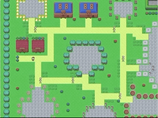

# JavaScript Capstone

Microverse's JavaScript Capstone Project

[![Contributors][contributors-shield]][contributors-url]
[![Forks][forks-shield]][forks-url]
[![Stargazers][stars-shield]][stars-url]
[![Issues][issues-shield]][issues-url]

## About the project

This is the Microverse JavaScript Capstone Project. It uses the Phaser engine. 
The task at hand is an RPG game. 
To check the video presentation for this project click [here](https://www.loom.com/share/4c268fe3d0dd411b80b86949b82d550c).




## Design Process

*Forest Man* design process started with the idea of creating a simple and beautiful RPG. The idea is inspired by traditional RPG classics like the Legend of Zelda and classic videogames like Pacman. 
Thanks to the folks in [opengameart.org](https://opengameart.org/) I was able to find the collection of tiles, spritesheets for enemies and the main character and diffrent objects that are used throughout the game.

## How to play

The objective of the game is to collect all coins in the map.
To move the main character a.k.a. 'Forest Man', you have to press the arrow keys in your keyboard.


## Features

- Multiple Screens
- Leaderboard
- Score system
- Tiled map
- Options menu

## Live Link

To preview the game please click [here](https://feature-working.d2e9bwicswb6z5.amplifyapp.com/).

## Technologies Used

This project utilizes:

- JavaScript
- Phaser
- HTML
- AWS Amplify
- Jest

### Getting Started

To get a local copy up and running follow these simple example steps.

### Prerequisites

 * [Node.js](https://nodejs.org/) is required to install dependencies and run scripts via npm.
 * A modern browser

### Clone

  - Clone with SSH:
  ```
    git@github.com:alvaropazz/js_capstone.git
  ```
  - Clone with HTTPS
  ```
    https://github.com/alvaropazz/js_capstone.git
  ```

### Setup

Install dependencies:

```
$ npm install
```

Start the local webserver:

```$ npm start``` > will open a local webserver at http://localhost:8080/ directly in your default browser with the game ready to be played

  ## Automated Test

* Run the command and see the output:
```$ npm run test```

## Contributors

- Alvaro Paz
  - Linkedin: [@alvaropaz](https://linkedin.com/in/alvaropaz/)
  - GitHub: [@alvaropazz](https://github.com/alvaropazz)
  - Twitter: [@alvaroipazr](https://twitter.com/alvaroipazr)

<!-- MARKDOWN LINKS & IMAGES -->

[contributors-shield]: https://img.shields.io/github/contributors/alvaropazz/js_capstone.svg?style=flat-square
[contributors-url]: https://github.com/alvaropazz/js_capstone/graphs/contributors
[forks-shield]: https://img.shields.io/github/forks/alvaropazz/js_capstone.svg?style=flat-square
[forks-url]: https://github.com/alvaropazz/js_capstone/network/members
[stars-shield]: https://img.shields.io/github/stars/alvaropazz/js_capstone.svg?style=flat-square
[stars-url]: https://github.com/alvaropazz/js_capstone/stargazers
[issues-shield]: https://img.shields.io/github/issues/alvaropazz/js_capstone.svg?style=flat-square
[issues-url]: https://github.com/alvaropazz/js_capstone/issues
